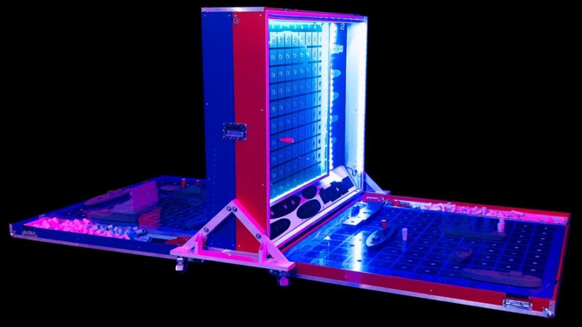

  

   
# Battleship
**Created by [Jesus Barrientos](https://www.linkedin.com/in/barrientosjesus/)**
#### [CLICK TO PLAY BATTLESHIP](https://chueyb.github.io/battleship/) 

  
  
  
   
  

## 📝 Description
This is the childhood game of Battleship with a Star Wars twist. Fight for the Empire or for the Rebel Alliance, and destroy their fleet first to win! 

# Screenshot
| Description | Screenshot |
|------------ | ------------|
| <h3 align="center">Alliance Choice</h3> | 
| <h3 align="center">Ship Placement</h3> | 
| <h3 align="center">In Progress</h3> | 

# Technologies Used

# Getting Started

How to Play

 
1. Select your Alliance. (Choosing between Galactic Empire and Rebel Alliance) 
 
2. Place your ships on the board.
 
3. Press play to start the game.
 
4. Select a square on the enemy side to take your turn.
 
5. Repeat til game over!
 

# Next Steps

- [ ] Add blaster animations
- [ ] Make computer smarter about choice
- [ ] Add rotate ship to scroll wheel
- [ ] Make ships draggable after placement
